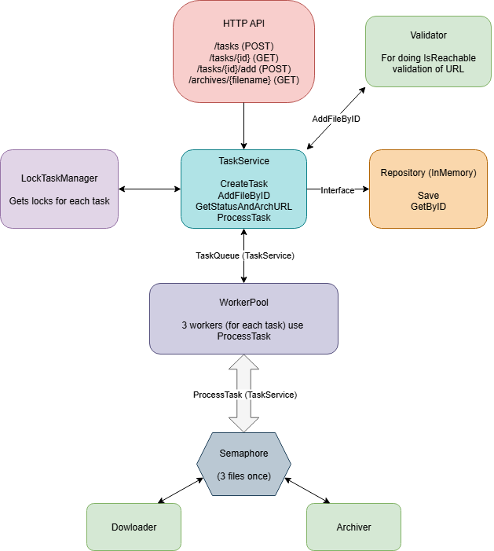

# Ziper

Этот проект представляет собой серверное приложение, написанное на языке Go и обрабатывающее присланные запросы по HTTP (REST).

## Возможности

- Создавать таски.
- Наполнять таски ссылками на файлы.
- Узнавать статус каждой таски и получать ссылку на архив со скаченными файлами.
- Скачивать готовые zip-архивы.

## Особенности

- Проект создавался с максимальным желанием сделать его масштабируемым в дальнейшем, поэтому во многом перегружен архитектурно (`clean architecture`). 
- Таски хранятся в мапе, защищенной `RWMutex`. 
- Доступ к содержимому в таске происходит посредством взаимодействия с примитивным менеджером блокировок, чтобы дополнительно защититься от гонки данных и увеличить потенциальную производительность.
- Ассинхронная обработка реализуется воркер пулом на уровне тасок и семафором на уровне файлов, хоть и понимаю, что это оказалось излишне с представленным ТЗ.
- Реализован recovery механизм на уровне работы горутин.
- В качестве счетчика активных тасок и счетчика для выдачи id использовался atomic, в случае с активными тасками для сравнения был реализован CAS-loop.
- usecase- и repository-слои протестированы.
- Первый раз использовал `slog`, как логгер для проекта, поэтому уверен, что им можно пользоваться намного грамотнее, чем это представлено в проекте.
- Конфиг подгружается из переменных окружения и если есть желание поиграться со значениями, нужно менять `.local.env` (default: max_tasks = 3, max_files_in_task = 3).
- Не использовал DTO из-за простоты бизнес сущностей, соответственно объекты запроса и ответа формируются внутри хэндлеров посредством анонимных структур с нужными полями.
- Для маршрутизации запросов использовал либу `gorilla/mux`, для избежания ситуаций, когда в таске несколько одинаковых файлов по названию `google/uuid` и для подгрузки `.env` - `caarlos0/env`.
- В конце файла представлена ориентировочная схема работы сервиса.

## Сборка и тестирование

1. Конфигурация .env файла

```shell
vim .env.local
```

2. Сборка и запуск

```shell
go build cmd/main.go
./main.out
```

3. `POST /tasks`

_request_
```
empty
```

_responses_

`201` - таска успешно создалась

```json
{
  "id": 1
}
```

`503` - в обработке находится максимальное количество тасок

```
active tasks exceeds max tasks 3
```

4. `POST /tasks/{id}/add`

_request_
```json
{
  "url": "http://example.pdf"
}
```

_responses_

`200` - файл успешно добавлен

```json
{
  "file_status": "accepted"
}
```
```json
{
  "file_status": "invalid_url"
}
```

`400` - в url указан некорректный или несуществующий id; превышен лимит файлов в таске

```
task exceeds max files 3
```

5. `GET /tasks/{id}`

_request_

```
empty
```

_responses_

`200` - архив готов к скачиванию

```json
{
  "status": "completed",
  "path": "http://example.com/archives/task-1.zip"
}
```

`200` - архив еще не готов

```json
{
  "status": "accepted"
}
```
```json
{
  "status": "in_progress"
}
```

`404` - таска не найдена

```
not found task by id 3
```

6. `GET /archives/{filename}`

_request_

```
empty
```

_responses_

`200` - файл готов к скачиванию

```
Content-Type: application/zip
Content-Disposition: attachment; filename="task-1.zip"
```

`400` - некорректное имя файла

```
invalid archive filename
```

`404` - архив не найден

```
failed to get archive path
```

`202` - архив в обработке 

```
archive still in progress
```

## Ссылки на файлы для тестирования

https://www.mir-nayka.com/jour/manager/files/samples/%D0%9F%D1%80%D0%B8%D0%BC%D0%B5%D1%80%D0%BE%D1%84%D0%BE%D1%80%D0%BC%D0%BB%D0%B5%D0%BD%D0%B8%D1%8F%D0%A1%D0%BF%D0%B8%D1%81%D0%BA%D0%B0%D0%BB%D0%B8%D1%82%D0%B5%D1%80%D0%B0%D1%82%D1%83%D1%80%D1%8B%D0%B8References_01-02-17.pdf \
https://www.hse.ru/data/2016/03/01/1125307124/%D0%91%D0%B8%D0%B1%D0%BB%D0%B8%D0%BE%D0%B3%D1%80%D0%B0%D1%84%D0%B8%D1%87%D0%B5%D1%81%D0%BA%D0%BE%D0%B5%20%D0%BE%D0%BF%D0%B8%D1%81%D0%B0%D0%BD%D0%B8%D0%B5%20%D0%B8%20%D0%BE%D1%84%D0%BE%D1%80%D0%BC%D0%BB%D0%B5%D0%BD%D0%B8%D0%B5%20%D1%81%D1%81%D1%8B%D0%BB%D0%BE%D0%BA.pdf \
https://grammarware.net/text/syutkin/HrefInLaTeX.pdf (отдает 406 код) \
https://s0.rbk.ru/v6_top_pics/media/img/8/90/346905343128908.jpeg \
https://s0.rbk.ru/v6_top_pics/media/img/2/46/347028990476462.jpeg \
https://s0.rbk.ru/v6_top_pics/media/img/5/52/347531730752525.jpeg \
https://s0.rbk.ru/v6_top_pics/media/img/7/96/346929798801967.jpeg \
https://s0.rbk.ru/v6_top_pics/media/img/7/79/347353794648797.jpeg \
https://s0.rbk.ru/v6_top_pics/media/img/2/02/347353810848022.jpeg 

## Схема

